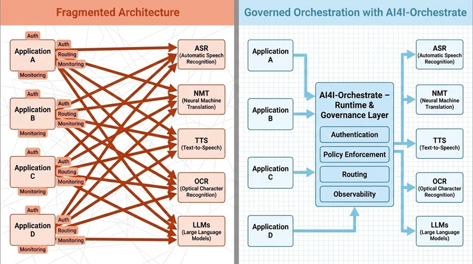

# Overview

AI4I-Orchestrate is the runtime orchestration and governance layer for Language AI systems operating at ecosystem or national scale. It acts as a centralized control plane that sits between applications and Language AI models, abstracting model selection, execution, and governance behind a unified API surface.

Rather than applications integrating directly with individual ASR, NMT, TTS, OCR, or LLM models, AI4I-Orchestrate introduces a single, governed runtime through which all Language AI requests flow. This allows policies, routing logic, observability, and feedback mechanisms to be applied consistently across all applications and tenants.

AI4I-Orchestrate is designed to operate Language AI as infrastructure — predictable, auditable, scalable, and continuously improving — rather than as isolated model integrations.

<figure><figcaption></figcaption></figure>
